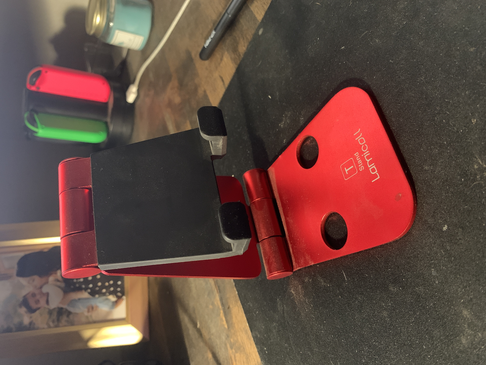
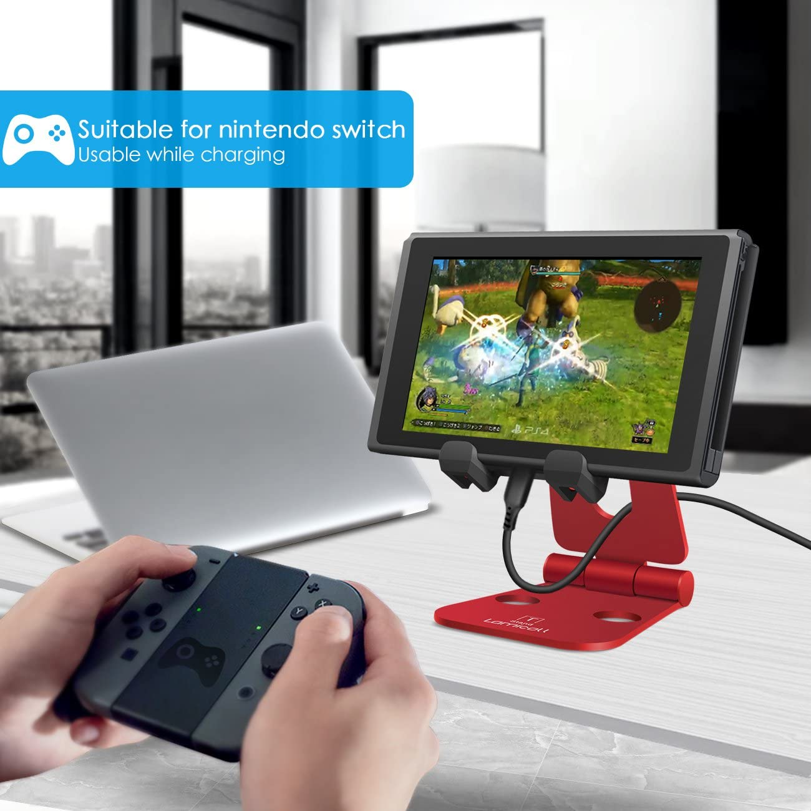
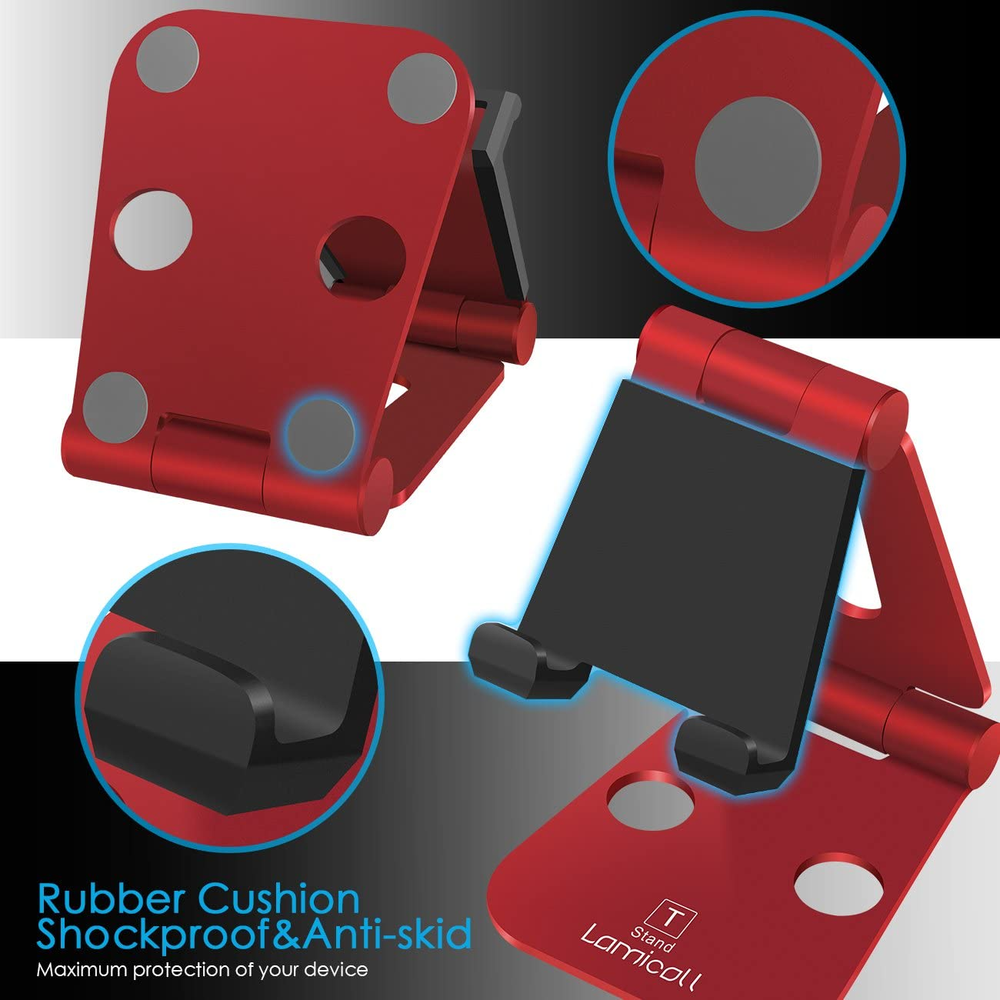
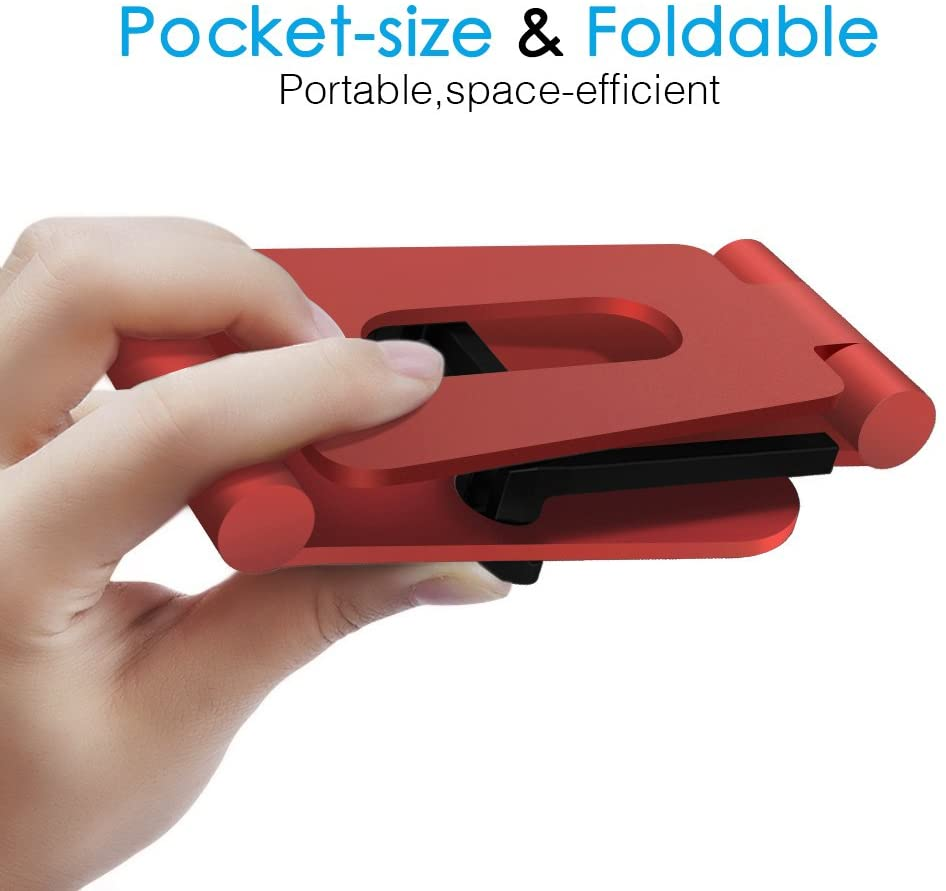
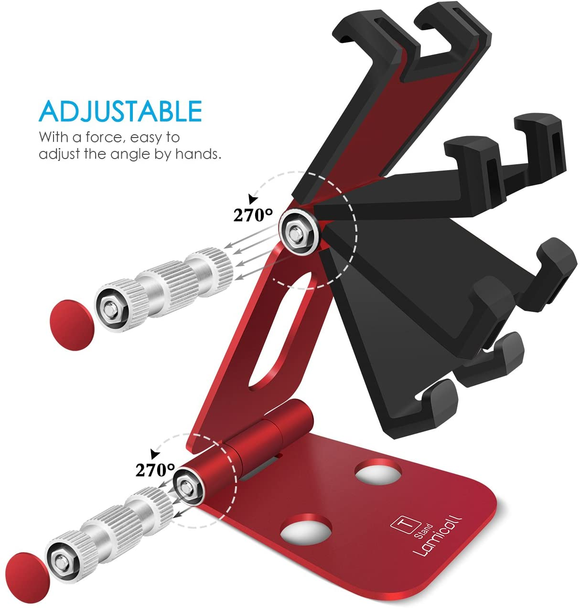
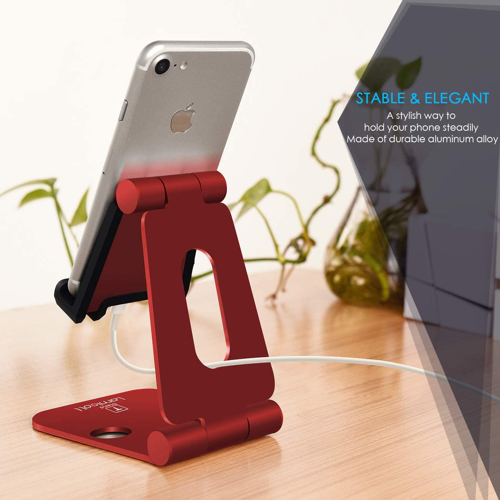

__Lamicall Adjustable Playstand__

Marko Ramos

April 29, 2021

In January of this year, I searched online for a stand that I could utilize for my Nintendo Switch. When I was carrying my Switch everywhere I went, I found it inconvenient to have to use the little built-in kickstand in the back of the Nintendo switch. The kickstand is very breakable, not very flexible, and can become difficult to pull out. There was also a huge problem when it came down to charge my Nintendo Switch. The charging port for the Switch is in the center bottom of the console. I could not use the built-in stand and charge my switch at the same time to continue my game. The Lamicall Adjustable Playstand was one of the affordable choices I saw on the first page of Amazon. I decided to order it for $15. 

The main reason I ordered it was because of its ability to hold my Nintendo switch and charge simultaneously. Not only was the stand __effective__ with its ability to charge and hold the Switch, but I was also surprised with the quality PlayStand. The stand is made of aluminum alloy which is proving very durable. 

The stand also has a rubber grip that holds any mobile device without scratching it. The bottom of the stand also has 4 rubber grips which help prevent it from slipping on the surface it’s on. This makes the stand __safe__ for mobile devices.   

  

The Playstand has proved to be a very __useful__ accessory due to its compact and portable design. The stand is __learnable__ as anyone can set it up at any angle and easily fold it with little to no instruction. Its simple design if __memorable__ as I don't even have to think about how to use when I pull it out of its case or out of my pocket. I can easily fold it to take on the go in my Switch case/bag, put it in my pocket, and store it away with the rest of my Nintendo Switch accessories. I tend not to store it away as I also now use it for my iPhone XR. Its become really __useful__ for my iPhone as I can watch a video on Youtube while on the stand, either with the phone up vertically or horizontally.  

The stand is __efficient__ at its purpose because it’s never out of balance when I adjust the angle for my Switch or for my phone. I don’t have an Ipad or larger tablet to try on the stand but I’m sure it would work fine with larger devices. I’ve been completely __satisfied__ with this product since day one and I’ll be using it until I replace it with a new one. At the time of this journal entry I cannot come up with any improvements on the stand's design as it met my needs and exceeded its __usefulness__. My wife kept stealing my stand off my desk for her mobile work phone, so I had to order a second one for her.
