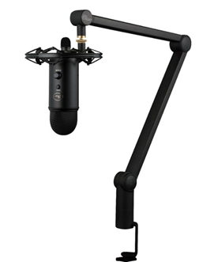
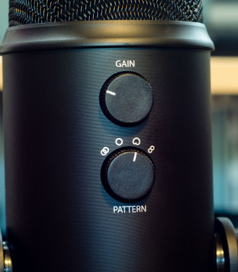
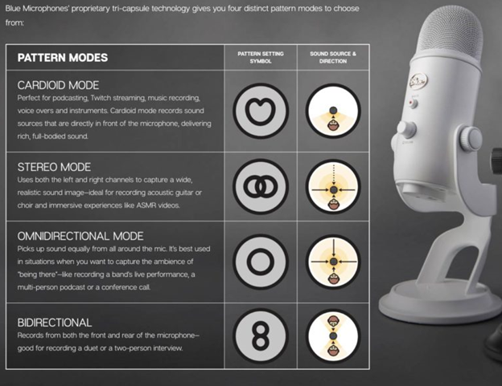

__Blue Yeti USB Microphone__

Marko Ramos 

March 6, 2021

I purchased the Blue Yeti “Yeticaster” USB Microphone in early 2019. At the time I worked at Best Buy and received a pretty good discount, so I did not hesitate to try it out. I ended up storing it for a year until the Covid-19 pandemic influenced my decision to go back to school. By the time I wanted to reassemble my microphone and mount, I had lost the instructions, but it was self-explanatory on what parts went where. There were a total of 3 parts: the microphone, the male USB to male Mini-USB, and the desk mount for mobility. After assembling the microphone, the device was “plug and play”. When I launched zoom after connecting the microphone, I was easily able to set the Blue Yeti microphone as the default and never really touch the settings again, unless I disconnected the USB cable to the microphone. Since Covid-19 and caused restrictions forced school to be completely online, communication needed to be even more efficient. As stated earlier, I was fortunate enough to have made the decision to purchase the microphone. All I needed to do is blow the dust off and reassemble it. The goal of connecting the microphone was to guarantee my voice was clear when joining zoom or discord voice/video calls. This microphone has helped achieve the goals of __efficiency__ and __effectiveness__. It increases the __efficiency__ because I do not have to look for my microphone or go through hook up or set up of the microphone. It was plug and play from the get-go and I have not had to tinker or troubleshoot any settings. It has been a very __useful__ tool. I like to participate in lectures and labs, and I know this microphone has helped me __effectively__ communicate with a very clear vocal message to the recipient(s) on the other side of the call. This has left my experience with this PC technology as an overall satisfied one. 

With all the positives from my experience with the Blue Yeti microphone, there are still a few minor flaws that I would like to mention. Because I am not a professional streamer and this was my first encounter with a USB to PC microphone, there were two settings that were not easily __learnable__. I did not understand what 2 knobs on the microphone meant. The first knob was a knob labeled “GAIN”. The second knob was labeled “PATTERN”. I guess this is my own doing as I had thrown out the manual before storing my microphone away for nearly a year.

After doing some googling, I was able to find that gain is simply the level of allowed sound input to the microphone. Essentially it is a volume control knob but for the audio the microphone is receiving. I am sure “gain” is the technical term for the control, but I think it’d be nice to relabel the knob to “Mic Volume” to better explain its purpose to me and other users. This might make this knob more __memorable__ to the average user like myself.

I had to google these two settings. An image from the manufacturer’s website simply described what the “PATTERN” knob meant. After understanding the pattern modes, I set my pattern to Cardioid mode to best match my requirements. Because the Pattern symbol patterns are not __memorable__ to me, I have saved this image for future reference in case I decide to repurpose my microphone. I do wish the patterns were easier to memorize and easier to associate to their purpose. The last flaw I struggle with is the microphone’s compatibility. Of course, it works fine with my PC with exception to the 2 minor flaws mentioned before. In my free time I enjoy online gaming on my Xbox One. The Blue yeti is not compatible with the Xbox one. I cannot completely blame the Blue Yeti manufacturer or completely blame Microsoft, but the fact that my Xbox has 3 available USB ports makes it a bummer that I cannot plug and play with the Blue Yeti and my Xbox. It would make the microphone a lot more useful for my lifestyle and I could use it for work and my personal life. I did some research and there are workarounds, but I must purchase a mic splitter and an extra 3.5 mm audio cable. I do not want any extra cables knowing it could have worked with one USB cable. If the Blue Yeti were compatible with gaming consoles as well as PCs/MACs I think that would make the product that much more __useful__ and __satisfying__ to me.
